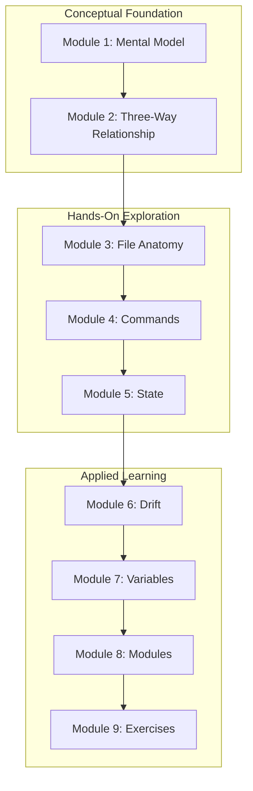

# Design Document: Terraform Fundamentals Learning Curriculum

## Overview

This design document outlines a structured learning curriculum for Terraform fundamentals, specifically designed for Salesforce developers transitioning to Infrastructure as Code. The curriculum leverages the learner's existing Salesforce Bedrock Agent project as a practical learning environment.

The design follows a progressive learning approach:
1. **Conceptual Foundation** - Map Terraform concepts to familiar Salesforce equivalents
2. **Hands-On Exploration** - Examine real project files to understand structure
3. **Guided Practice** - Execute safe commands with immediate feedback
4. **Applied Learning** - Make real changes to reinforce understanding

This is a documentation/learning spec, not a code implementation spec. The deliverables are markdown documents that serve as a comprehensive learning guide.

## Architecture

### Curriculum Structure

```
┌─────────────────────────────────────────────────────────────────────┐
│                    TERRAFORM FUNDAMENTALS CURRICULUM                 │
├─────────────────────────────────────────────────────────────────────┤
│                                                                      │
│  Module 1: The Mental Model                                         │
│  ┌─────────────────────────────────────────────────────────────┐   │
│  │  "Terraform = Metadata Deployment for AWS"                   │   │
│  │                                                               │   │
│  │  Salesforce World          →    Terraform World              │   │
│  │  ─────────────────              ────────────────             │   │
│  │  Metadata XML files        →    .tf files                    │   │
│  │  sf project deploy start   →    terraform apply              │   │
│  │  sf project deploy preview →    terraform plan               │   │
│  │  Custom Settings           →    terraform.tfvars             │   │
│  │  Unlocked Packages         →    modules/                     │   │
│  │  Deployment Status         →    terraform.tfstate            │   │
│  └─────────────────────────────────────────────────────────────┘   │
│                                                                      │
│  Module 2: The Three-Way Relationship                               │
│  ┌─────────────────────────────────────────────────────────────┐   │
│  │                                                               │   │
│  │     .tf Code          terraform.tfstate         AWS Reality  │   │
│  │   (Desired State)    (Terraform's Memory)    (Actual State)  │   │
│  │        │                     │                      │        │   │
│  │        └─────────────────────┼──────────────────────┘        │   │
│  │                              │                                │   │
│  │                    terraform plan                             │   │
│  │                   (compares all 3)                            │   │
│  │                              │                                │   │
│  │                    terraform apply                            │   │
│  │                  (syncs AWS to code)                          │   │
│  │                                                               │   │
│  └─────────────────────────────────────────────────────────────┘   │
│                                                                      │
│  Module 3: File Anatomy                                             │
│  Module 4: Command Mastery                                          │
│  Module 5: State Deep Dive                                          │
│  Module 6: Drift Management                                         │
│  Module 7: Variables & Configuration                                │
│  Module 8: Modules                                                  │
│  Module 9: Practical Exercises                                      │
│                                                                      │
└─────────────────────────────────────────────────────────────────────┘
```

### Learning Flow



## Components and Interfaces

### Module 1: The Mental Model

**Purpose**: Establish foundational understanding by mapping Terraform to Salesforce concepts.

**Content Structure**:
```markdown
# What is Terraform?

## The One-Sentence Explanation
Terraform is "Metadata Deployment for AWS" - it does for cloud infrastructure 
what SFDX does for Salesforce orgs.

## The Salesforce-to-Terraform Rosetta Stone

| You Know This (Salesforce)     | Learn This (Terraform)           |
|-------------------------------|----------------------------------|
| Metadata XML files            | `.tf` files (HCL syntax)         |
| `sf project deploy start`     | `terraform apply`                |
| `sf project deploy preview`   | `terraform plan`                 |
| Custom Settings records       | `terraform.tfvars`               |
| Custom Metadata Type defs     | `variables.tf`                   |
| Unlocked Packages             | `modules/`                       |
| Deployment tracking           | `terraform.tfstate`              |
| Sandbox refresh               | `terraform destroy` + `apply`    |

## Declarative vs Imperative

Salesforce developers already think declaratively:
- You don't write "create field, then add to layout, then set permissions"
- You declare the desired state in metadata XML, and Salesforce figures out the steps

Terraform works the same way:
- You don't write "create IAM role, wait, then create Lambda, then attach role"
- You declare what you want, Terraform figures out the order
```

### Module 2: The Three-Way Relationship

**Purpose**: Explain the critical relationship between code, state, and reality.

**Content Structure**:
```markdown
# The Three Pillars of Terraform

## Understanding the Triangle

┌──────────────┐     ┌──────────────┐     ┌──────────────┐
│   .tf Code   │     │   .tfstate   │     │  AWS Reality │
│              │     │              │     │              │
│ What you     │     │ What TF      │     │ What actually│
│ WANT         │     │ REMEMBERS    │     │ EXISTS       │
└──────────────┘     └──────────────┘     └──────────────┘
       │                    │                    │
       └────────────────────┼────────────────────┘
                            │
                   terraform plan
                  (compares all 3)

## What Happens During `terraform plan`

1. Reads your `.tf` files (desired state)
2. Reads `terraform.tfstate` (remembered state)  
3. Queries AWS API (actual state)
4. Computes the diff between all three
5. Shows you what needs to change

## Salesforce Analogy

Think of it like:
- `.tf` files = Your local metadata in VS Code
- `.tfstate` = Salesforce's internal deployment tracking
- AWS Reality = What's actually in the org

When you run `sf project deploy preview`, Salesforce compares your local 
metadata against what's deployed. Terraform does the same thing.
```

### Module 3: File Anatomy

**Purpose**: Explain each file type with concrete examples from the learner's project.

**Key Files to Cover**:
1. `variables.tf` - Input definitions
2. `terraform.tfvars` - Actual values (secrets!)
3. `main.tf` - Orchestration
4. `locals.tf` - Computed values
5. `terraform.tfstate` - State tracking
6. Module structure (`modules/*/main.tf`)

**Teaching Approach**:
- Show actual file content from the project
- Annotate with comments explaining each section
- Draw parallels to Salesforce equivalents

### Module 4: Command Mastery

**Purpose**: Teach the essential commands with safety emphasis.

**Commands to Cover**:

| Command | Purpose | Safety Level | SF Equivalent |
|---------|---------|--------------|---------------|
| `terraform init` | Initialize | Safe | Install plugins |
| `terraform validate` | Syntax check | Safe | Validate metadata |
| `terraform plan` | Preview | Safe (read-only) | Deploy preview |
| `terraform apply` | Deploy | Caution | Deploy start |
| `terraform destroy` | Delete all | Danger | Delete sandbox |
| `terraform output` | Show values | Safe | View results |
| `terraform fmt` | Format code | Safe | Prettier |

**Safety Workflow**:
```bash
# The Golden Rule: ALWAYS plan before apply
terraform plan          # Review changes
terraform apply         # Only if plan looks good
```

### Module 5: State Deep Dive

**Purpose**: Demystify state management and prevent common disasters.

**Key Concepts**:
1. State as "Terraform's memory"
2. Why state exists (tracking, dependencies, performance)
3. State file structure (JSON, resource mappings)
4. What happens if state is deleted (orphaned resources)
5. State locking (preventing concurrent modifications)

**Warnings to Emphasize**:
- Never manually edit `.tfstate`
- Never delete `.tfstate` without understanding consequences
- Never commit `.tfstate` to git (contains secrets)

### Module 6: Drift Management

**Purpose**: Teach drift detection and resolution strategies.

**Content Structure**:
```markdown
# What is Drift?

Drift = AWS reality differs from what Terraform expects

## Common Causes
1. Someone changed AWS via console
2. Another tool modified resources
3. AWS auto-updated something
4. Team member applied different code

## Detection
terraform refresh   # Update state from AWS
terraform plan      # Shows drift as changes

## Resolution Options

Option A: Override (make AWS match your code)
terraform apply

Option B: Accept (update code to match AWS)
# Copy values from `terraform state show <resource>`
# Paste into your .tf file
# Plan should show no changes

## Intentional Drift: lifecycle ignore_changes
resource "aws_lambda_function" "api" {
  # ... config ...
  
  lifecycle {
    ignore_changes = [filename, source_code_hash]
  }
}
```

### Module 7: Variables & Configuration

**Purpose**: Teach the variable system with Salesforce analogies.

**Concepts to Cover**:
1. Variable declaration (type, default, description, sensitive)
2. Variable precedence (defaults → tfvars → env → CLI)
3. String interpolation (`${var.name}`)
4. Local values (computed variables)
5. Output values (exposing data)

**Salesforce Mapping**:
- `variables.tf` = Custom Metadata Type definition
- `terraform.tfvars` = Custom Settings records
- `locals` = Formula fields
- `outputs` = Return values from a Flow

### Module 8: Modules

**Purpose**: Explain modular architecture using the project's existing modules.

**Project Modules to Analyze**:
```
modules/
├── bedrock_agent/   # AI Agent (complex, many resources)
├── lambda/          # Function + IAM (medium complexity)
├── sqs/             # Queue + DLQ (simple)
├── eventbridge/     # Event routing
└── secrets/         # Credentials management
```

**Module Anatomy**:
```hcl
# modules/sqs/main.tf

# 1. INPUTS (what the module needs)
variable "project_name" { type = string }
variable "visibility_timeout" { type = number }

# 2. RESOURCES (what the module creates)
resource "aws_sqs_queue" "main" {
  name = "${var.project_name}-queue"
  visibility_timeout_seconds = var.visibility_timeout
}

# 3. OUTPUTS (what the module exposes)
output "queue_arn" {
  value = aws_sqs_queue.main.arn
}
```

**Calling Modules**:
```hcl
# main.tf

module "sqs" {
  source = "./modules/sqs"
  
  # Pass inputs
  project_name       = var.project_name
  visibility_timeout = 300
}

# Use outputs
module "lambda" {
  source = "./modules/lambda"
  sqs_queue_arn = module.sqs.queue_arn  # Reference output
}
```

### Module 9: Practical Exercises

**Purpose**: Hands-on practice with the learner's actual project.

**Exercise List**:

1. **Read & Interpret** - Run `terraform plan`, understand output
2. **Safe Change** - Add a tag, apply, verify in AWS console
3. **Create Drift** - Change something in AWS console, detect with plan
4. **Resolve Drift** - Practice both override and accept strategies
5. **Add Variable** - Create new variable, use in resource
6. **Trace Data Flow** - Follow a value from tfvars → module → resource → output
7. **Explore State** - Run `terraform state list`, `terraform state show`

## Data Models

### Curriculum Document Structure

The curriculum will be delivered as a single comprehensive markdown document with the following structure:

```
docs/TERRAFORM_FUNDAMENTALS_CURRICULUM.md
├── Introduction
│   └── How to Use This Guide
├── Module 1: The Mental Model
│   ├── Salesforce-to-Terraform Mapping Table
│   └── Declarative Thinking
├── Module 2: The Three-Way Relationship
│   ├── Diagram
│   └── Explanation
├── Module 3: File Anatomy
│   ├── variables.tf Deep Dive
│   ├── terraform.tfvars Explained
│   ├── main.tf Walkthrough
│   └── State File Structure
├── Module 4: Command Mastery
│   ├── Command Reference Table
│   ├── Safety Workflow
│   └── Common Flags
├── Module 5: State Management
│   ├── Why State Exists
│   ├── State File Anatomy
│   └── Recovery Procedures
├── Module 6: Drift Management
│   ├── Detection
│   ├── Resolution Strategies
│   └── Lifecycle Blocks
├── Module 7: Variables
│   ├── Declaration Syntax
│   ├── Precedence Rules
│   └── Best Practices
├── Module 8: Modules
│   ├── Module Anatomy
│   ├── Project Module Walkthrough
│   └── When to Create Modules
├── Module 9: Exercises
│   ├── Exercise 1-7 with Instructions
│   └── Rollback Procedures
├── Quick Reference Card
└── Troubleshooting Guide
```

### Salesforce Analogy Reference Table

| Terraform Concept | Salesforce Equivalent | Key Insight |
|-------------------|----------------------|-------------|
| `.tf` files | Metadata XML | Declarative infrastructure definition |
| `terraform.tfvars` | Custom Settings | Environment-specific values, never commit |
| `variables.tf` | Custom Metadata Type | Structure definition without values |
| `terraform.tfstate` | Deployment tracking | Internal state, don't touch |
| `modules/` | Unlocked Packages | Reusable, versioned components |
| `terraform init` | `sf plugins install` | One-time setup |
| `terraform plan` | `sf project deploy preview` | Safe preview |
| `terraform apply` | `sf project deploy start` | Execute deployment |
| `terraform destroy` | Delete sandbox | Permanent removal |
| `outputs` | Flow return values | Expose data to callers |
| `locals` | Formula fields | Computed values |
| Provider | Connected App | Authentication to external system |
| Resource | Metadata component | Single deployable unit |
| Data source | SOQL query | Read existing data |


## Correctness Properties

*A property is a characteristic or behavior that should hold true across all valid executions of a system—essentially, a formal statement about what the system should do. Properties serve as the bridge between human-readable specifications and machine-verifiable correctness guarantees.*

### Analysis

This is a **learning/documentation spec**, not a code implementation spec. The deliverable is a comprehensive markdown curriculum document. All acceptance criteria are content verification requirements—checking that specific explanations, analogies, exercises, and warnings exist in the document.

Since this spec produces documentation rather than executable code, the acceptance criteria are best validated through:
1. **Content checklists** - Verify presence of required sections
2. **Manual review** - Ensure explanations are clear and accurate
3. **Learner feedback** - Validate effectiveness through actual use

### Content Verification Properties

While not property-based tests in the traditional sense, we can define content properties that the curriculum document must satisfy:

**Property 1: Salesforce Analogy Completeness**
*For any* Terraform concept introduced in the curriculum, there SHALL exist a corresponding Salesforce analogy or equivalent mapping.
**Validates: Requirements 1.1, 1.2, 2.1, 2.2, 2.3, 6.4**

**Property 2: Project Reference Grounding**
*For any* practical example or exercise in the curriculum, it SHALL reference actual files or resources from the learner's existing Salesforce Bedrock Agent project.
**Validates: Requirements 2.5, 3.6, 4.5, 5.6, 6.5, 7.5, 8.6**

**Property 3: Safety Warning Coverage**
*For any* potentially destructive operation (apply, destroy, state modification), the curriculum SHALL include explicit warnings and safety guidance.
**Validates: Requirements 3.4, 3.5, 4.3, 4.4, 9.1, 9.2, 9.4**

**Property 4: Exercise Reversibility**
*For any* hands-on exercise that modifies infrastructure, the curriculum SHALL provide rollback instructions to restore the original state.
**Validates: Requirements 8.7**

**Property 5: Command-to-Salesforce Mapping**
*For any* Terraform command taught, there SHALL exist an equivalent Salesforce CLI command or concept for comparison.
**Validates: Requirements 3.1, 3.2, 3.3, 3.4**

### Verification Checklist

Since this is documentation, verification is performed via checklist review:

| Section | Required Content | Validates |
|---------|-----------------|-----------|
| Module 1 | "Metadata Deployment for AWS" phrase | 1.1 |
| Module 1 | Salesforce-to-Terraform mapping table | 1.2 |
| Module 1 | Declarative vs imperative explanation | 1.3 |
| Module 2 | Three-way relationship diagram | 1.4 |
| Module 3 | variables.tf = Custom Metadata Type | 2.1 |
| Module 3 | terraform.tfvars = Custom Settings | 2.2 |
| Module 3 | main.tf orchestrator explanation | 2.3 |
| Module 3 | State file warnings | 2.4 |
| Module 3 | Project file references | 2.5 |
| Module 4 | init command explanation | 3.1 |
| Module 4 | plan as read-only preview | 3.2 |
| Module 4 | apply as deployment | 3.3 |
| Module 4 | destroy with warnings | 3.4 |
| Module 4 | Plan-before-apply workflow | 3.5 |
| Module 5 | State as "memory" analogy | 4.1 |
| Module 5 | Three-way comparison | 4.2 |
| Module 5 | Manual edit warning | 4.3 |
| Module 5 | Deletion warning + recovery | 4.4 |
| Module 5 | State file structure example | 4.5 |
| Module 5 | State locking explanation | 4.6 |
| Module 6 | Drift definition | 5.1 |
| Module 6 | Drift causes list | 5.2 |
| Module 6 | refresh + plan for detection | 5.3 |
| Module 6 | Override vs accept strategies | 5.4 |
| Module 6 | lifecycle ignore_changes | 5.5 |
| Module 7 | Variable types (string, number, etc.) | 6.1 |
| Module 7 | Precedence order | 6.2 |
| Module 7 | sensitive = true | 6.3 |
| Module 7 | String interpolation | 6.6 |
| Module 8 | Module = reusable package | 7.1 |
| Module 8 | inputs/resources/outputs structure | 7.2 |
| Module 8 | Module calling syntax | 7.3 |
| Module 8 | Output usage between modules | 7.4 |
| Module 8 | Local vs registry modules | 7.6 |
| Module 9 | Plan interpretation exercise | 8.1 |
| Module 9 | Safe change exercise | 8.2 |
| Module 9 | Drift exercise | 8.3 |
| Module 9 | Variable exercise | 8.4 |
| Module 9 | Value tracing exercise | 8.5 |
| Module 9 | Rollback instructions | 8.7 |
| Safety | Git commit warnings | 9.1 |
| Safety | Plan-first emphasis | 9.2 |
| Safety | Idempotency explanation | 9.3 |
| Safety | Destroy permanence warning | 9.4 |
| Safety | Error recovery section | 9.5 |
| Safety | Pre-flight checklist | 9.6 |

## Error Handling

Since this is a documentation spec, "errors" refer to potential gaps or issues in the curriculum:

### Content Gaps
- **Missing Analogy**: If a Terraform concept lacks a Salesforce equivalent, provide a clear explanation of why it's unique to IaC
- **Outdated Information**: Include version numbers and last-updated dates; flag content that may change with Terraform updates
- **Project Mismatch**: If the learner's project structure differs from examples, provide guidance on adapting exercises

### Learner Confusion Points
- **State File Anxiety**: Emphasize that state is recoverable; provide `terraform import` guidance
- **Destroy Fear**: Clarify that destroy only affects Terraform-managed resources; provide sandbox recommendations
- **Drift Panic**: Normalize drift as common; emphasize detection before resolution

### Exercise Failures
- **AWS Permission Errors**: Include IAM troubleshooting section
- **State Lock Issues**: Provide `terraform force-unlock` guidance with warnings
- **Resource Already Exists**: Explain `terraform import` as recovery mechanism

## Testing Strategy

### Documentation Review Process

Since this is a learning curriculum (not code), testing involves:

1. **Content Completeness Review**
   - Use the verification checklist above
   - Ensure all 9 modules are present
   - Verify all acceptance criteria are addressed

2. **Technical Accuracy Review**
   - Validate all Terraform commands are correct
   - Verify Salesforce analogies are accurate
   - Test all code snippets for syntax errors

3. **Learner Validation**
   - Have a Salesforce developer (target audience) review
   - Gather feedback on clarity of analogies
   - Identify confusing sections

4. **Exercise Validation**
   - Execute each exercise against the actual project
   - Verify rollback instructions work
   - Confirm exercises don't cause permanent damage

### Quality Criteria

The curriculum is considered complete when:
- [ ] All 9 modules are written
- [ ] All items in verification checklist are present
- [ ] All code snippets are syntax-valid
- [ ] All exercises have been tested
- [ ] At least one Salesforce developer has reviewed for clarity
